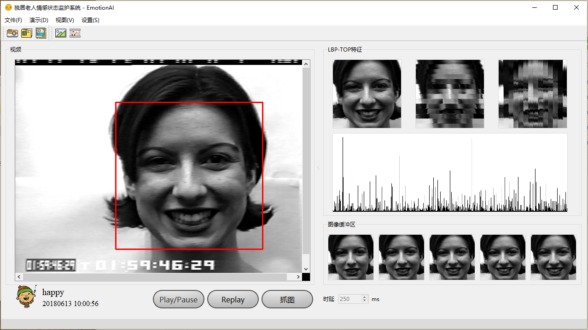
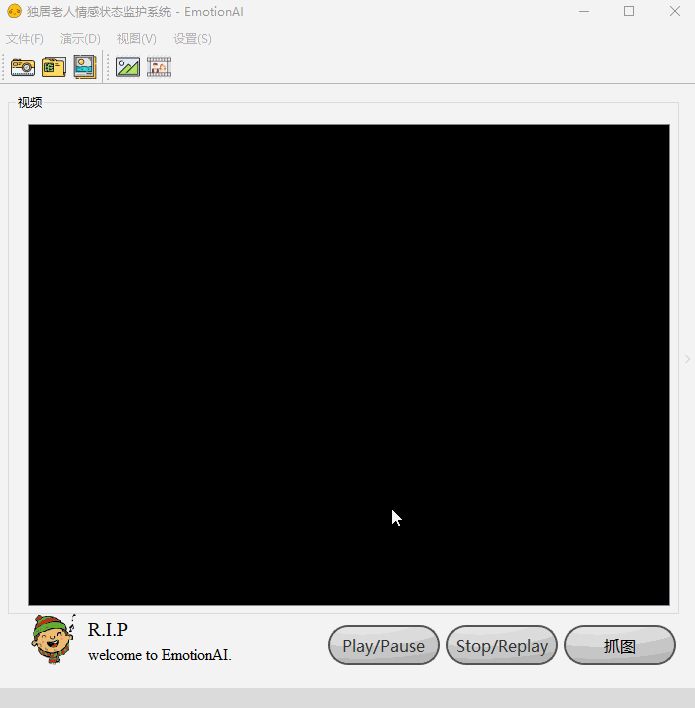

# lbptop emotion recognition
Emotion recognition system based on LBP-TOP. 基于LBP-TOP的情绪自动识别系统.

This is just a **Debug Try** for https://github.com/dbarshan/Anuvab.

# Algorithm

1. Facial face detection: **Adaboost**;
2. Facial expression extraction: **LBP-TOP**;
3. Facial expression classification and recognition: **SVM** (tool: libsvm 3.22).

# Database

CK+ (The Extended Cohn-Kanade AU-Coded Facial Expression Database, CK+).

# Demo

1. Program logo

   

2. Main Windows

   

3. Recognize Image Sequence

   

# Other

Thanks for [@Anuvab](https://github.com/dbarshan/Anuvab).
