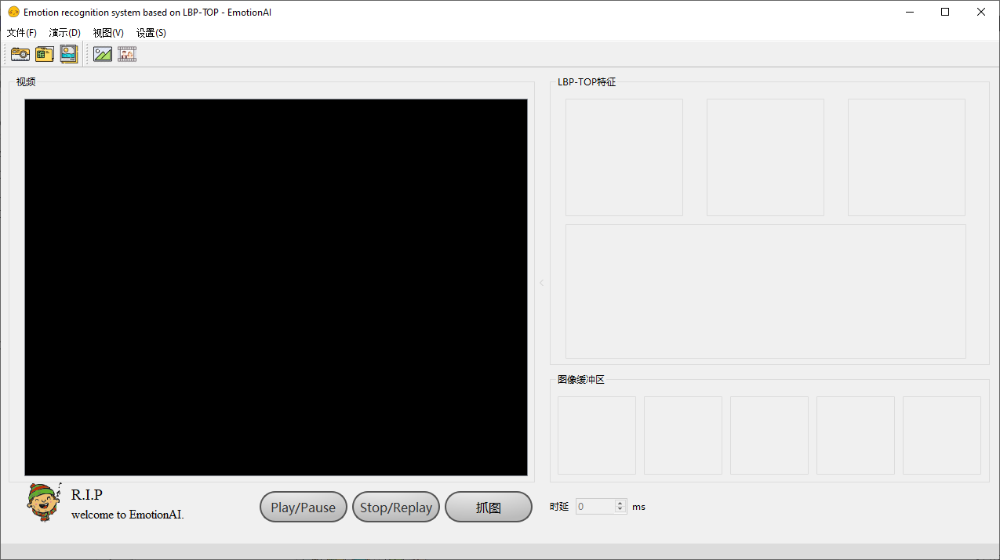

# lbptop emotion recognition
Emotion recognition system based on LBP-TOP. 基于LBP-TOP的情绪自动识别系统.

## Feature

* Algorithm

  1. Facial face detection: **Adaboost**;
  2. Facial expression extraction: **LBP-TOP**;
  3. Facial expression classification and recognition: **SVM** (tool: libsvm 3.22).

* Database

  * CK+ (The Extended Cohn-Kanade AU-Coded Facial Expression Database, CK+).

## Directory Structure

| Path                             | Content                        |
| -------------------------------- | ------------------------------ |
| EmotionAI\\**EmotionAI.sln**     | Visual Studio Project Solution |
| EmotionAI\EmotionAI\TrainModel   | Train Model                    |
| EmotionAI\EmotionAI\TestFile     | test files                     |
| EmotionAI\EmotionAI\EmotionImage | output                         |

## Usage

1. Open the project **EmotionAI.sln** with Visual Studio 2015 (or others higher version)
2. Run the **Local Window Dbugger**

## Demo

### 1. Real Time Emotion Recognize

Waiting for your try. 

### 2. Recognize Static Video

### 3. Recognize Image Sequence

## Changelog

* May 25, 2021 adjust demo 

* Jun 13, 2018 first release

## Contact

Email: zscandyz(you know)gmail(dot)com

## Other

Thanks for [@Anuvab](https://github.com/dbarshan/Anuvab).